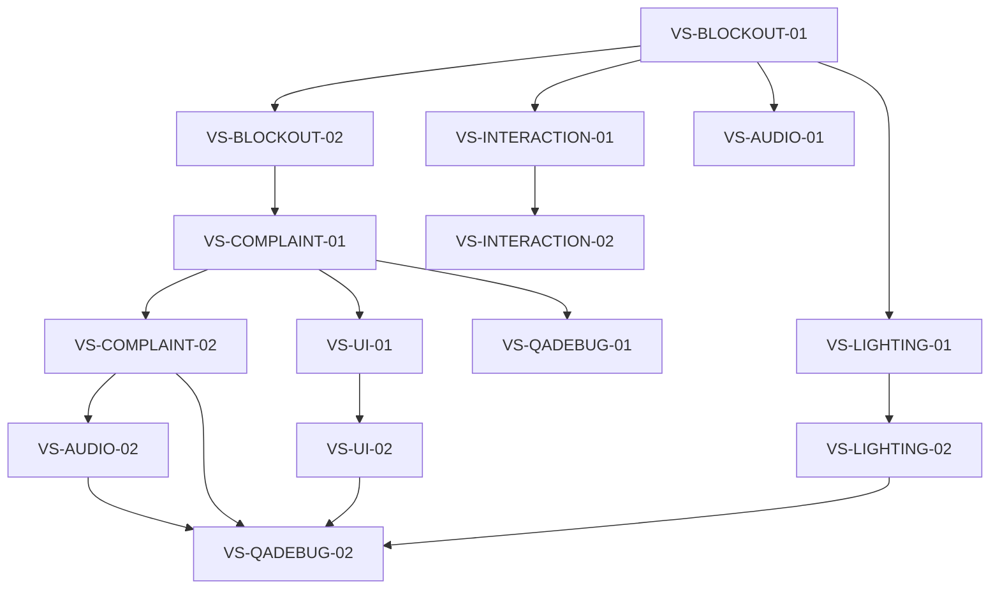
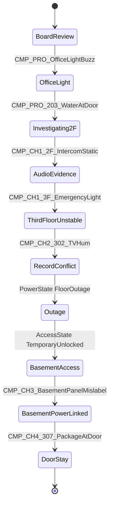
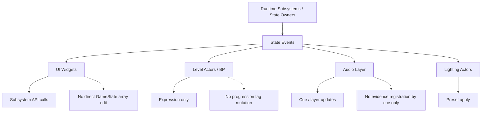
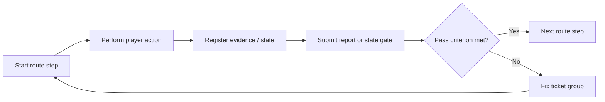
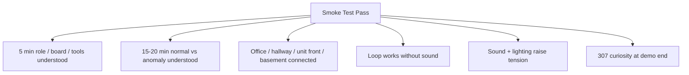
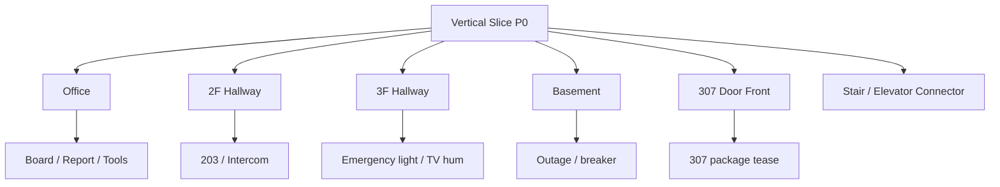

---
aliases:
  - "NightCaretaker Vertical Slice Diagrams"
tags:
  - nightcaretaker
  - project/nightcaretaker
  - archive
  - companion
type: project-document
project: NightCaretaker
category: archive-companion
status: organized
updated: 2026-05-26
cssclasses:
  - readable-guide
---

# NightCaretaker Vertical Slice Diagrams

> [!summary] 문서 목적
> 이 문서는 데모 수직 슬라이스 제작 체크리스트를 빠르게 검토하기 위한 Mermaid companion 문서다. 구현 기준은 Master 문서와 `NightCaretaker_VerticalSlice_Detail.md`를 우선한다.

## 핵심 결론

- 이 문서는 보조 시각화 또는 세부 자료이며, 활성 기준은 루트 Master 문서를 우선한다.
- 다이어그램, 매트릭스, 와이어프레임은 현재 판단의 근거로 사용할 수 있지만 그대로 구현 기준이 되지는 않는다.
- 필요 시 본문의 항목을 Planning/Development/Art Master로 승격한다.

## 문서 정보

| 항목 | 내용 |
| --- | --- |
| 프로젝트 | NightCaretaker / 야간 관리인: 307호의 민원 |
| 문서 범주 | 보조 시각화/동반 자료 |
| 파일 경로 | `Archive/Companion/NightCaretaker_VerticalSlice_Diagrams.md` |
| 프로젝트 경로 | `D:\UnrealProjects\NightCaretaker` |
| 정리 기준 | `Obsidian 문서 가독성 기준.md`, `HTML CSS 문서 제작 및 활용 기준.md` |

## 문서 지도

| 섹션 | 역할 |
| --- | --- |
| 목적 | 주요 섹션 |
| Vertical Slice Route | 주요 섹션 |
| Ticket Dependency Flow | 주요 섹션 |
| State Gate Sequence | 주요 섹션 |
| Ownership Boundary | 주요 섹션 |
| Smoke-Test Loop | 주요 섹션 |
| Smoke-Test Criteria | 주요 섹션 |
| P0 Art / Implementation Split | 주요 섹션 |

## 적용 기준

- 원문 의미와 프로젝트 용어를 보존한다.
- 긴 설명은 제목, 표, 목록, 체크리스트 중심으로 탐색 가능하게 유지한다.
- 활성 기준과 보관 자료를 구분한다.
- HTML companion 문서는 각 파일 내부에 CSS를 포함하는 self-contained 문서로 관리한다.

## 본문

## 목적

이 문서는 데모 수직 슬라이스 제작 체크리스트를 빠르게 검토하기 위한 Mermaid companion 문서다. 구현 기준은 Master 문서와 `NightCaretaker_VerticalSlice_Detail.md`를 우선한다.

## Vertical Slice Route

```mermaid
flowchart LR
    A["1 Office Handoff"] --> B["2 OfficeLightBuzz"]
    B --> C["3 203WaterAtDoor"]
    C --> D["4 IntercomStatic"]
    D --> E["5 3F EmergencyLight"]
    E --> F["6 302 TVHum"]
    F --> G["7 Power Outage"]
    G --> H["8 BasementPumpAlarm"]
    H --> I["9 BasementPanelMislabel"]
    I --> J["10 307PackageAtDoor"]

    J --> K["Demo End<br/>307 curiosity"]
```

## Ticket Dependency Flow

## State Gate Sequence

## Ownership Boundary

## Smoke-Test Loop

## Smoke-Test Criteria

## P0 Art / Implementation Split

## 검토 체크리스트

- [ ] 현재 판단 기준과 보관/조사 자료가 구분되어 있다.
- [ ] 다음 작업자가 먼저 볼 섹션을 문서 지도에서 찾을 수 있다.
- [ ] 표, 목록, 체크리스트가 긴 문단을 보완한다.
- [ ] Planning/Development/Art Master와 충돌하는 항목은 별도로 승격 또는 폐기 판단한다.
- [ ] HTML companion이 필요한 경우 외부 CSS 의존 없이 내장 CSS로 작성한다.
