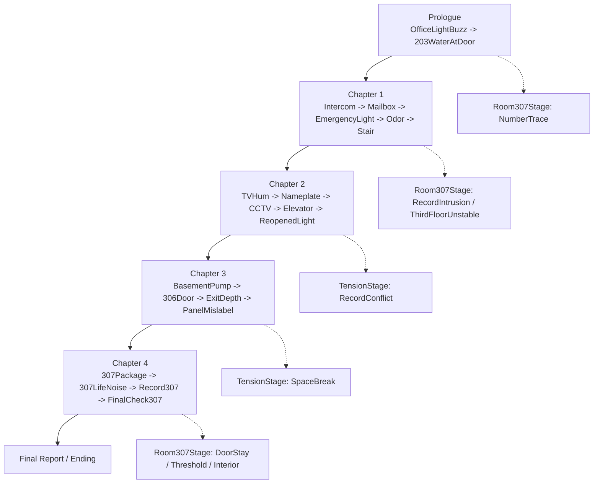
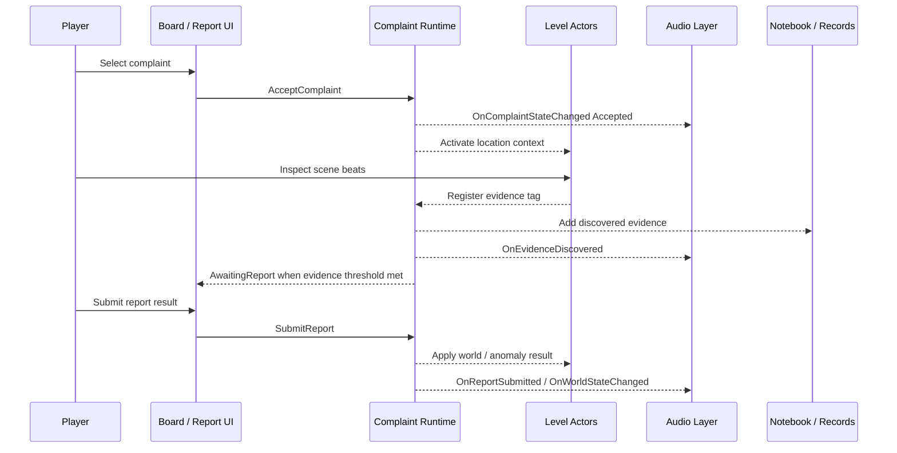
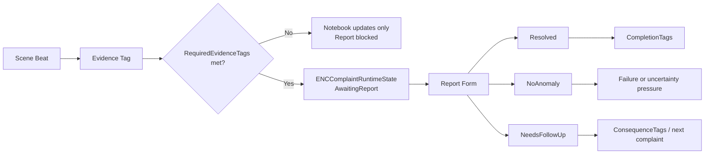
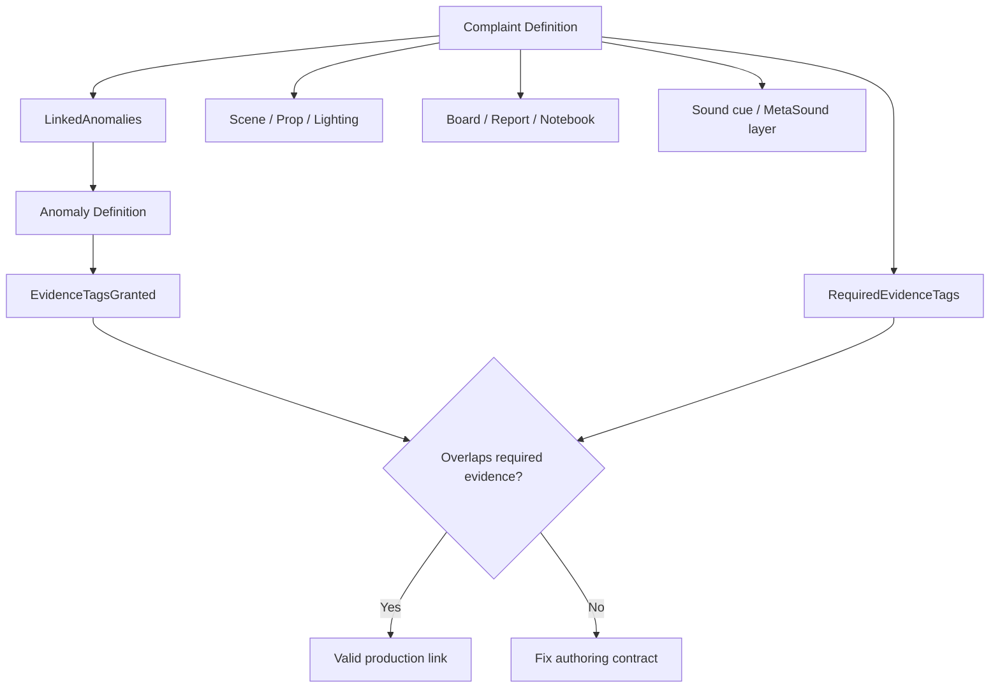
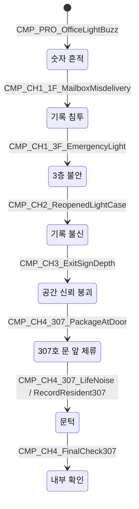
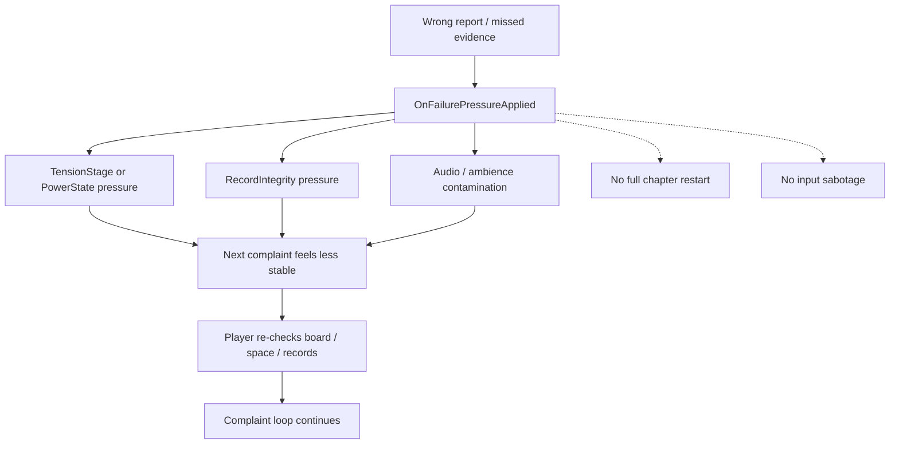
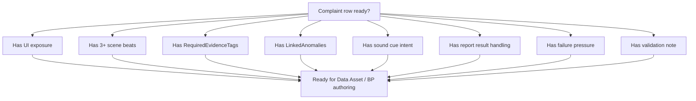

# NightCaretaker Complaint/Anomaly Diagrams

## 목적

이 문서는 20개 민원과 이상 현상 흐름을 빠르게 검토하기 위한 Mermaid companion 문서다. 구현 기준은 Master 문서와 `NightCaretaker_ComplaintAnomaly_Detail.md`를 우선한다.

## Chapter Complaint Flow

## One Complaint Production Sequence

## Evidence To Report Flow

## Anomaly Link Model

## Room 307 Escalation By Complaint

## Failure Pressure Loop

## P0 Authoring Validation

