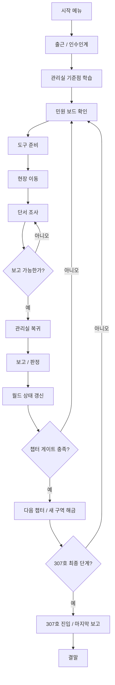
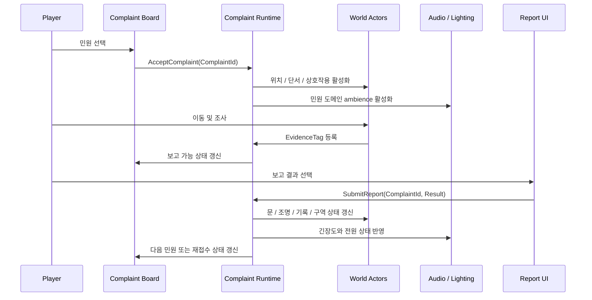
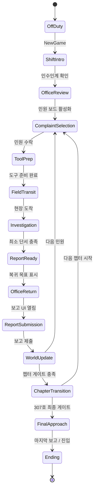
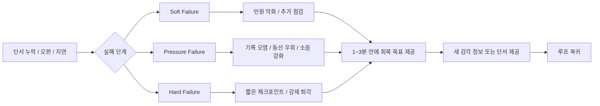
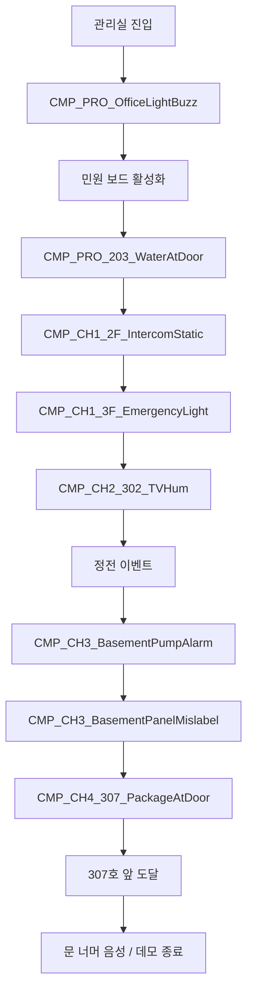

# NightCaretaker Game Flow Diagrams

이 문서는 `NightCaretaker_Planning_Master.md`의 게임 플로우 제작 명세를 빠르게 읽기 위한 companion 문서다. 기준 문서는 Master 문서이며, 이 문서는 플로우를 시각적으로 확인하기 위한 보조 자료다.

## 전체 캠페인 플로우

## 민원 1건 시퀀스

## 상태 모델

## 실패와 회복 플로우

## 데모 / 수직 슬라이스 Route

## 챕터 게이트 요약

| 구간 | 핵심 목표 | 반드시 검증할 플레이 이해 |
| --- | --- | --- |
| 프롤로그 | 관리실, 도구, 보고 루프 학습 | 이 게임은 민원을 처리하는 게임이다. |
| 챕터 1 | 현실적 민원과 작은 위화감 | 같은 업무라도 현장 상태가 이상할 수 있다. |
| 챕터 2 | 판정형 민원과 기록 불일치 | 수리가 아니라 보고 판단이 진행을 바꾼다. |
| 챕터 3 | 정전, 지하실, 설비 계통 | 건물 상태가 플레이어에게 압박으로 돌아온다. |
| 챕터 4 | 307호로 모든 단서 수렴 | 307호를 확인해야 이 밤이 끝난다. |
| 결말 | 마지막 보고 또는 마지막 진입 | 해결보다 해석과 잔상이 남아야 한다. |
