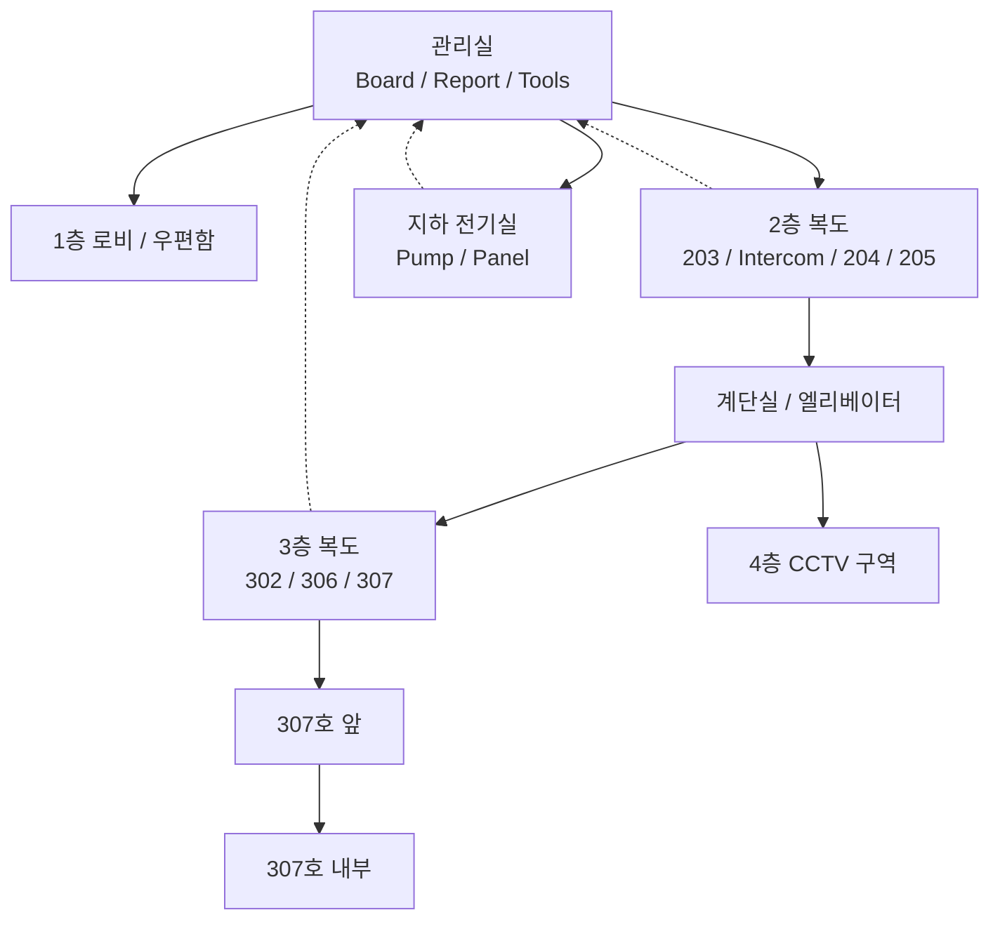
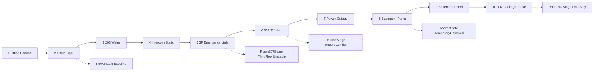
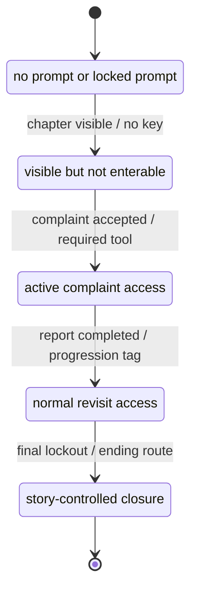
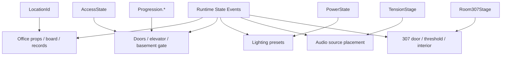
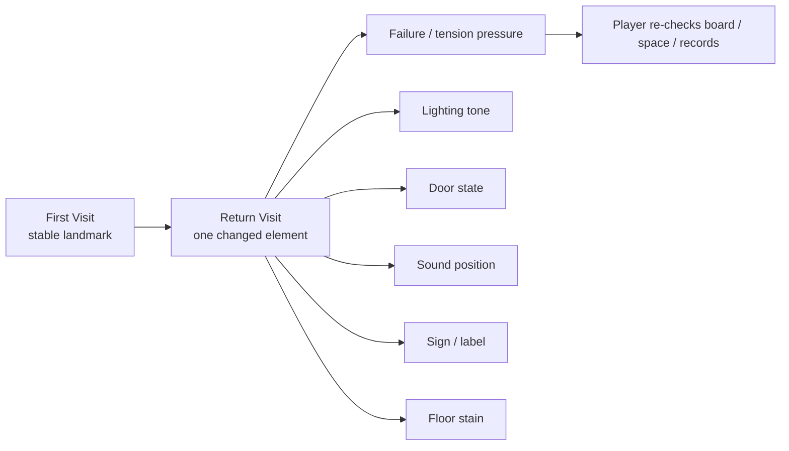
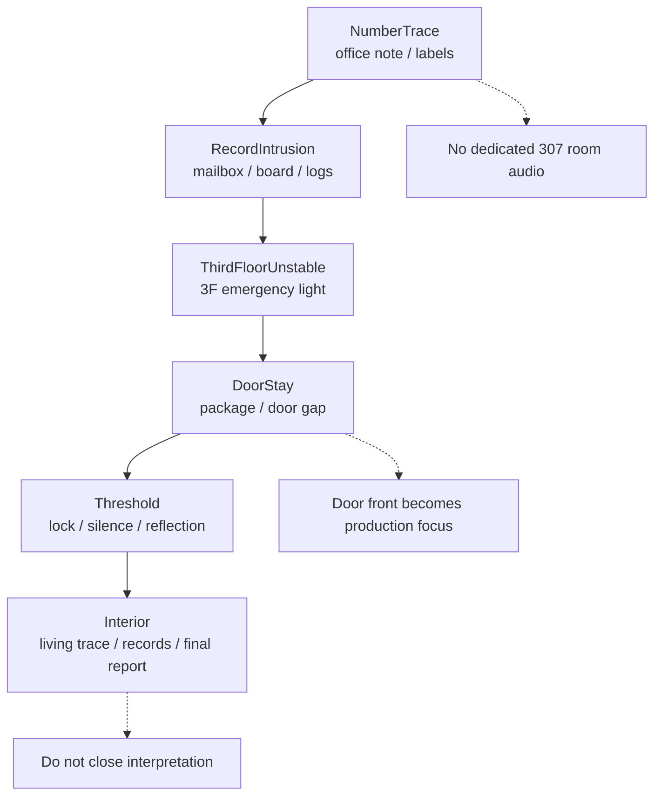
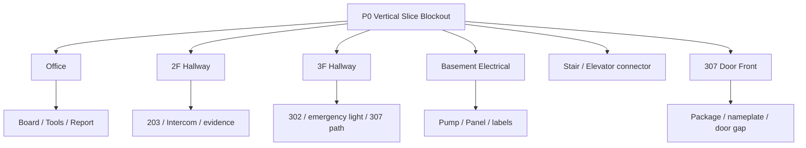

# NightCaretaker Level/Space Diagrams

## 목적

이 문서는 레벨/공간 제작 기준을 빠르게 검토하기 위한 Mermaid companion 문서다. 구현 기준은 Master 문서와 `NightCaretaker_LevelSpace_Detail.md`를 우선한다.

## Building Space Flow

## Vertical Slice Route

## Access State Flow

## State Consumers Per Space

## Revisit Variation Model

## Room 307 Spatial Convergence

## P0 Blockout Scope

