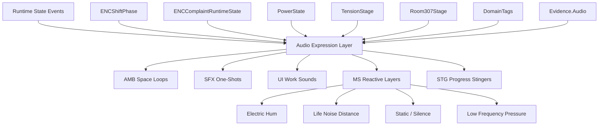
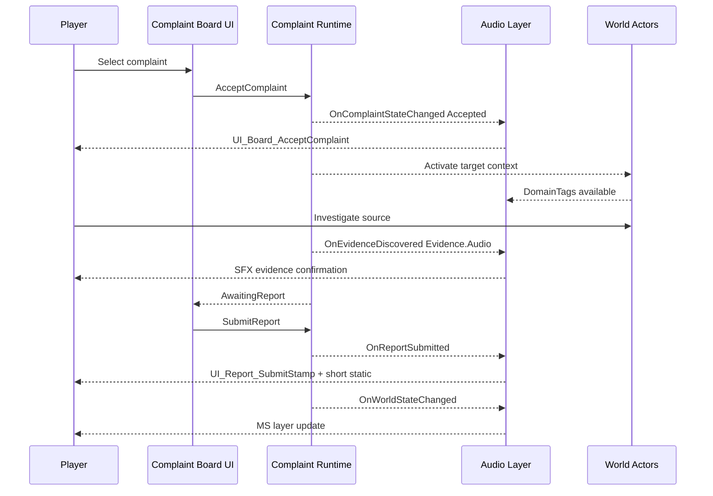
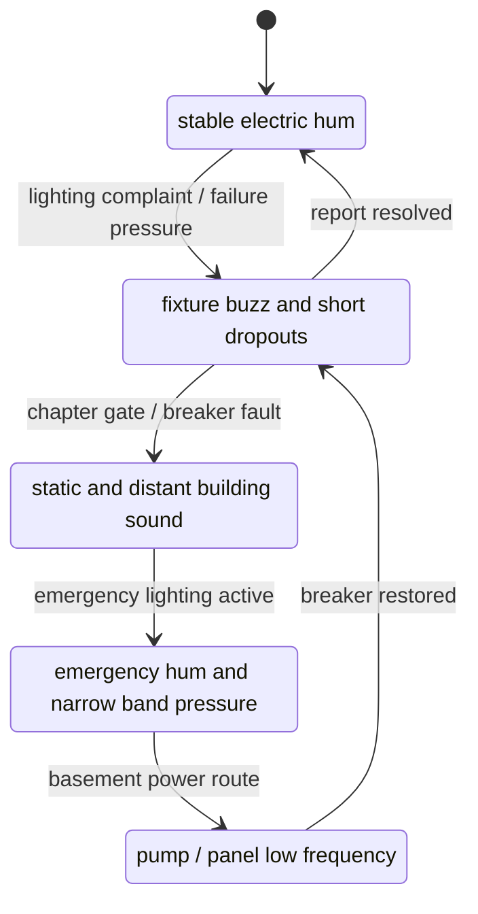
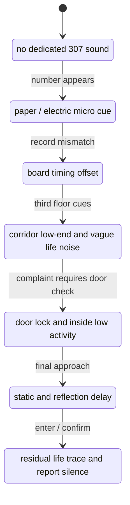
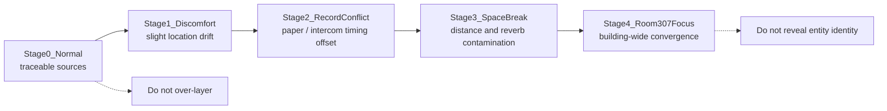
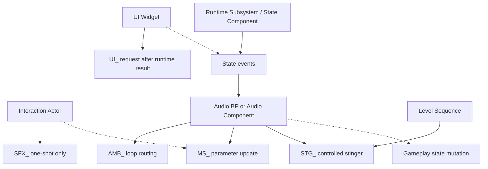
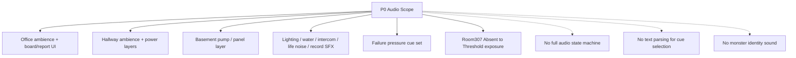

# NightCaretaker Sound Diagrams

## 목적

이 문서는 사운드 제작 명세를 빠르게 검토하기 위한 Mermaid companion 문서다. 구현 기준은 Master 문서와 `NightCaretaker_Sound_Detail.md`를 우선한다.

## Audio State Input Flow

## Complaint Audio Sequence

## PowerState Audio State

## Room 307 Sound Exposure

## TensionStage Layer Direction

## Blueprint Trigger Ownership

## P0 Sound Scope

