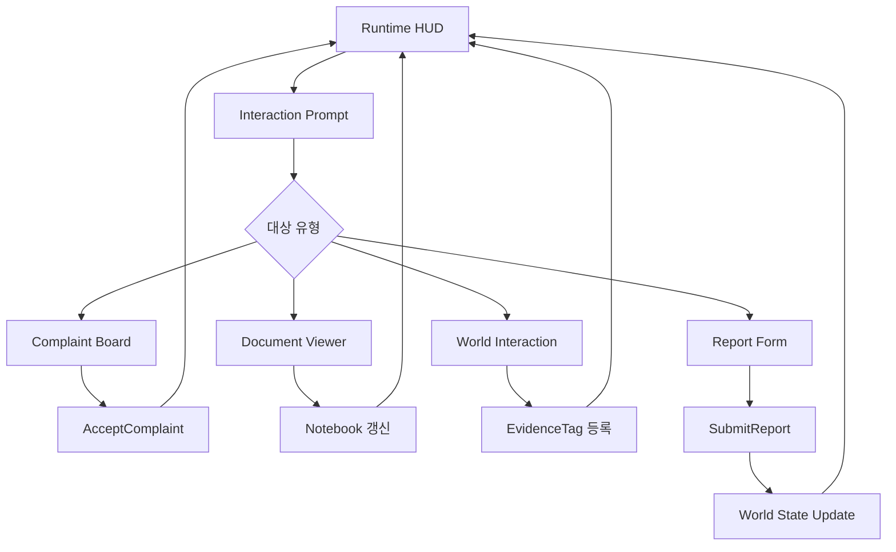

# NightCaretaker UI/UX Detail

이 문서는 `NightCaretaker_Planning_Master.md`의 UI/UX 상세 명세를 제작에 옮기기 위한 companion 문서다. 기준 문서는 Master 문서이며, 이 문서는 화면별 구성, 상태, 입력, 데이터 연결, UMG 제작 계약을 한 곳에서 확인하기 위한 보조 자료다.

## UI 목표

- 플레이어가 지금 해야 할 일을 놓치지 않게 한다.
- 화면 상시 HUD를 최소화하고, 핵심 정보는 관리실 보드, 기록장, 보고서, 월드 표식으로 전달한다.
- 공포 연출을 설명하지 않고 업무 도구처럼 보여야 한다.
- 후반 UI 오염은 진행 방해가 아니라 기록 신뢰도 붕괴로 작동해야 한다.
- 구현은 현재 프로젝트의 `UNCUISubsystem` + `UNCPlayerHUDWidget` + `UNCUserWidget` 기반 UMG 구조를 기준으로 한다.

## 구현 기준 요약

| 항목 | 현재 기준 |
| --- | --- |
| UI 프레임워크 | Project UMG native classes |
| HUD 소유자 | `ANCPlayerControllerBase`가 local controller에서 `UNCUISubsystem`을 통해 생성 |
| HUD native parent | `UNCPlayerHUDWidget` |
| 공통 위젯 native parent | `UNCUserWidget` |
| 입력 정책 enum | `ENCWidgetInputPolicy` |
| HUD 상태 구조체 | `FNCHUDState` |
| CommonUI | `DefaultGame.ini` 설정 흔적만 있음. 현재 런타임 UI 코드 기준이 아니며 향후 메뉴/설정 화면 후보로만 검토 |

## Unreal Widget Implementation Contract

| 타입 | 책임 | 제작 계약 |
| --- | --- | --- |
| `ANCPlayerControllerBase` | 로컬 플레이어 HUD 시작점 | `BeginPlay()`에서 `ShowRuntimeHUD()`를 호출한다. `PlayerHUDWidgetClass`가 설정된 local controller만 HUD를 생성한다. |
| `UNCUISubsystem` | local-player 단위 HUD lifetime/state 관리자 | 위젯 인스턴스를 직접 소유하고 `FNCHUDState`를 캐시한다. Gameplay code는 HUD 위젯을 직접 만지지 않고 subsystem API를 호출한다. |
| `UNCUserWidget` | 프로젝트 UMG 공통 베이스 | 각 위젯은 `InputPolicy`를 `EditDefaultsOnly`로 정하고, 필요 시 `GetNCUISubsystem()`으로 local subsystem을 조회한다. |
| `UNCPlayerHUDWidget` | 런타임 HUD native parent | `ApplyHUDState()`로 `bShowReticle`, `bHasReticleFocus`를 반영한다. `ReticleImage`는 `BindWidgetOptional` 이름을 유지한다. |
| `ENCWidgetInputPolicy` | 화면별 입력 점유 정책 | Runtime HUD는 `GameOnly`, 업무 화면은 `GameAndUI`, pause/settings는 `UIOnly`를 기본값으로 한다. |
| `FNCHUDState` | 최소 HUD 표시 상태 | 현재 필드는 `bShowReticle`, `bHasReticleFocus`다. Prompt/tool/toast 상태는 별도 확장 시 subsystem 또는 view-model 계층에서 다룬다. |

### 런타임 UI 생성 흐름

1. `ANCPlayerControllerBase::BeginPlay()`가 실행된다.
2. `ShowRuntimeHUD()`가 local controller인지, `PlayerHUDWidgetClass`가 설정되어 있는지 확인한다.
3. `ULocalPlayer`에서 `UNCUISubsystem`을 가져온다.
4. `UNCUISubsystem::ShowPlayerHUD()`가 `WBP_NCPlayerHUD` 인스턴스를 생성하거나 재사용한다.
5. `UNCUISubsystem::SetHUDState()`, `SetReticleVisible()`, `SetReticleFocus()`가 `UNCPlayerHUDWidget::ApplyHUDState()`로 상태를 전달한다.

### CommonUI 적용 위치

CommonUI는 현재 즉시 적용 기준이 아니다. 다만 추후 메뉴/설정 화면에서 플랫폼별 입력 glyph, focus navigation, layered menu stack이 필요해지면 `WBP_NCPauseMenu`, `WBP_NCSettingsMenu`에 한정해 검토할 수 있다. P0 문서 기준은 기존 UMG 구조 유지다.

## 화면 목록

| 화면 / 위젯 | 역할 | 입력 정책 | 열리는 조건 | 닫히는 조건 |
| --- | --- | --- | --- | --- |
| Runtime HUD | 조준점, 짧은 상호작용 가능 여부 | `GameOnly` | 플레이 시작 | 메뉴/보드/보고 화면 열림 |
| Interaction Prompt | 대상 이름과 가능한 행동 표시 | `GameOnly` | 포커스 대상 감지 | 포커스 해제 또는 메뉴 진입 |
| Tool Quick Select | 현재 도구와 짧은 교체 피드백 | `GameOnly` | 도구 선택 입력 | 1~2초 후 자동 숨김 |
| Complaint Board | 활성 민원 목록과 상세 확인 | `GameAndUI` | 관리실 보드 상호작용 | 닫기 / 민원 수락 |
| Report Form | 확보 단서와 보고 결과 제출 | `GameAndUI` | 보고 가능 상태에서 관리실 보고 상호작용 | 제출 / 닫기 |
| Notebook | 발견 단서, 위치, 기록 요약 | `GameAndUI` | 기록장 입력 또는 특정 문서 읽기 | 닫기 |
| Document Viewer | 메모, 명부, 정비 로그 읽기 | `GameAndUI` | 월드 문서 상호작용 | 닫기 |
| Pause Menu | 이어하기, 설정, 나가기 | `UIOnly` | Pause 입력 | 이어하기 |
| Settings | 그래픽, 오디오, 입력, 접근성 | `UIOnly` | Pause Menu에서 진입 | 뒤로가기 |
| Toast / Save Notice | 짧은 상태 피드백 | `GameOnly` | 저장, 도구 획득, 단서 기록 | 자동 숨김 |

## 화면 흐름

개발자용 Mermaid 다이어그램은 `NightCaretaker_UIUX_Diagrams.md`를 우선한다. 이 문서의 흐름은 화면 제작자가 빠르게 읽는 요약이다.



## UMG Style Guide

### 공통 팔레트

| 토큰 | 용도 | 느낌 |
| --- | --- | --- |
| Paper / Ink | 보고서, 기록장, 보드 문서 영역 | 낡은 사무용 종이와 검은 잉크 |
| Fluorescent Green / Teal | focus, 확인 가능, 시스템 정상 | 형광등 아래 차가운 업무 도구 |
| Warning Amber | 주의, 미확인, 추가 확인 필요 | 업무 경고 스탬프 |
| Rust Red | 위험, 오류, 기록 충돌 | 제한적으로만 사용 |
| Metal Gray | 패널, 표, 탭, 버튼 배경 | 관리실 장비와 캐비닛 |

### 텍스트 크기 기준

| 레벨 | 사용처 | 권장 |
| --- | --- | --- |
| Screen Title | 보드/보고서/설정 화면 제목 | 24-30 px |
| Section Title | 패널 내부 그룹 제목 | 16-20 px |
| Body | 목록, 본문, 상세 설명 | 13-15 px |
| Metadata | 위치, 태그, 시각, 상태 | 12-13 px |
| Prompt | 상호작용 한 줄 안내 | 13-15 px |

텍스트는 후반 오염 상태에서도 판독 가능해야 한다. 글자를 완전히 깨뜨리거나 과도한 흔들림으로 플레이어 입력 판단을 방해하지 않는다.

### 컴포넌트 제작 기준

| 컴포넌트 | 기준 |
| --- | --- |
| Button | 업무용 양식의 선택 영역처럼 보이게 한다. 기본/주요/위험 상태만 둔다. |
| Tabs | Notebook과 Settings에 사용한다. 현재 탭은 색상보다 경계선/배경 차이로 읽히게 한다. |
| Tags | 민원 분류, 도구 요구, 상태에 사용한다. 많은 색을 만들지 않는다. |
| Table / List | 민원 번호, 위치, 상태를 빠르게 스캔할 수 있게 열 너비를 고정한다. |
| Prompt | 한 줄 기본. `대상명 - 입력 행동` 순서를 유지한다. |
| Toast | 저장/단서/도구 피드백 전용. 1~3초 후 사라지고 진행을 막지 않는다. |
| Stamp | `수락됨`, `조사 중`, `보고 가능`, `완료`, `재접수` 같은 업무 상태에 사용한다. |

### 금지 스타일

- 미니맵, 상시 퀘스트 로그, 체력/스태미나 HUD를 P0 HUD에 넣지 않는다.
- 진행 버튼을 숨기거나 입력을 먹지 않는 방식으로 공포를 만들지 않는다.
- 붉은색을 일반 emphasis로 쓰지 않는다.
- 과한 glitch, RGB split, 화면 전체 노이즈를 기본 UI 스타일로 사용하지 않는다.
- CommonUI 기반이라고 문서화하지 않는다. 현재 구현 기준은 프로젝트 UMG 클래스다.

## Widget Tree Specification

아래 트리는 Blueprint asset을 생성하지 않고, 제작 기준 이름과 계층만 고정한다. 실제 위젯 제작 시 이름 충돌이 있으면 C++ binding이 있는 항목을 우선한다.

### `WBP_NCPlayerHUD`

Native parent: `UNCPlayerHUDWidget`

```text
WBP_NCPlayerHUD
└─ CanvasPanel RootCanvas
   ├─ Image ReticleImage [BindWidgetOptional, existing C++ name]
   ├─ Overlay PromptLayer
   │  └─ WBP_NCInteractionPrompt InteractionPrompt
   ├─ Overlay ToolFeedbackLayer
   │  └─ WBP_NCToolQuickSelect ToolQuickSelect
   └─ Overlay ToastLayer
      └─ WBP_NCToast ToastSlot
```

`ReticleImage` 이름은 바꾸지 않는다. 바인딩이 없어도 native code가 안전하게 동작하지만, reticle tint/visibility를 C++에서 직접 반영하려면 해당 이름을 유지해야 한다.

### `WBP_NCComplaintBoard`

Native parent: `UNCUserWidget`

```text
WBP_NCComplaintBoard
└─ Overlay RootOverlay
   └─ Border BoardFrame
      └─ VerticalBox BoardLayout
         ├─ WBP_NCBoardHeader Header
         ├─ HorizontalBox Body
         │  ├─ ScrollBox ComplaintList
         │  │  └─ WBP_NCComplaintRow Rows
         │  └─ WBP_NCComplaintDetail DetailPanel
         └─ HorizontalBox CommandBar
            ├─ Button AcceptButton
            ├─ Button LocateButton
            └─ Button CloseButton
```

### `WBP_NCReportForm`

Native parent: `UNCUserWidget`

```text
WBP_NCReportForm
└─ Border ReportFrame
   └─ VerticalBox ReportLayout
      ├─ WBP_NCReportHeader Header
      ├─ HorizontalBox Body
      │  ├─ ScrollBox EvidenceList
      │  └─ VerticalBox ResultOptions
      │     └─ WBP_NCReportResultButton ResultButtons
      └─ HorizontalBox CommandBar
         ├─ Button SubmitButton
         ├─ Button OpenNotebookButton
         └─ Button CloseButton
```

### `WBP_NCNotebook`

Native parent: `UNCUserWidget`

```text
WBP_NCNotebook
└─ Border NotebookFrame
   └─ VerticalBox NotebookLayout
      ├─ HorizontalBox TabBar
      │  ├─ Button CurrentComplaintTab
      │  ├─ Button EvidenceTab
      │  ├─ Button LocationTab
      │  └─ Button Room307Tab
      └─ WidgetSwitcher PageSwitcher
         ├─ WBP_NCNotebookComplaintPage
         ├─ WBP_NCNotebookEvidencePage
         ├─ WBP_NCNotebookLocationPage
         └─ WBP_NCNotebook307Page
```

### `WBP_NCDocumentViewer`

Native parent: `UNCUserWidget`

```text
WBP_NCDocumentViewer
└─ Overlay RootOverlay
   ├─ Border DocumentFrame
   │  └─ ScrollBox DocumentScroll
   │     └─ RichTextBlock DocumentBody
   └─ HorizontalBox FooterCommands
      ├─ TextBlock ClosePromptText
      └─ Button AddNoteButton
```

### `WBP_NCPauseMenu`

Native parent: `UNCUserWidget`

```text
WBP_NCPauseMenu
└─ Border MenuFrame
   └─ VerticalBox MenuLayout
      ├─ TextBlock TitleText
      ├─ Button ResumeButton
      ├─ Button SettingsButton
      ├─ Button MainMenuButton
      └─ Button QuitButton
```

### `WBP_NCSettingsMenu`

Native parent: `UNCUserWidget`

```text
WBP_NCSettingsMenu
└─ Border SettingsFrame
   └─ HorizontalBox SettingsLayout
      ├─ VerticalBox CategoryTabs
      │  ├─ Button GameplayTab
      │  ├─ Button VideoTab
      │  ├─ Button AudioTab
      │  ├─ Button ControlsTab
      │  └─ Button AccessibilityTab
      └─ VerticalBox SettingPanel
         ├─ WidgetSwitcher SettingPages
         └─ HorizontalBox CommandBar
```

### `WBP_NCToast`

Native parent: `UUserWidget` 또는 `UNCUserWidget`

```text
WBP_NCToast
└─ Border ToastFrame
   └─ HorizontalBox ToastLayout
      ├─ Image StatusIcon
      └─ TextBlock MessageText
```

## Runtime HUD

| 항목 | 명세 |
| --- | --- |
| 목적 | 상호작용 가능 여부만 최소한으로 알려준다. |
| 구성 | 중심 reticle, focus tint, 선택적 짧은 prompt anchor |
| 표시 | 기본 표시. 보드, 보고서, 기록장, pause 중에는 숨김 |
| 데이터 | `FNCHUDState.bShowReticle`, `FNCHUDState.bHasReticleFocus` |
| 금지 | 체력, 스태미나, 미니맵, 퀘스트 로그 상시 표시 |

## Interaction Prompt

| 상태 | 문구 예시 | 조건 |
| --- | --- | --- |
| Use | `E 사용` | 스위치, 문, 배전반 |
| Inspect | `E 확인` | 문패, 물기, 전기함, 생활 흔적 |
| Read | `E 읽기` | 메모, 명부, 로그, 공지문 |
| Report | `E 보고서 작성` | 관리실 보고 위치 + `AwaitingReport` |
| Locked | `잠겨 있음` | 접근 불가 문 |
| Need Tool | `드라이버 필요` | RequiredToolTag 미충족 |

Prompt는 한 줄을 기본으로 한다. 대상 이름이 필요하면 `대상명 - 행동` 순서로 짧게 표시한다. 예: `3층 비상등 - 확인`.

## Complaint Board

| 영역 | 내용 |
| --- | --- |
| 상단 | 현재 챕터/근무 구간, 접수 건수, 시간 표기 |
| 좌측 목록 | 민원 번호, 제목, 위치, 상태 |
| 우측 상세 | 접수 문구, 비고, 필요 도구, 보고 가능 결과 |
| 하단 명령 | 수락, 위치 확인, 닫기 |

데이터 연결:

| UI 필드 | 데이터 소스 |
| --- | --- |
| 제목 | `UNCComplaintDefinition.Title` |
| 요약 | `BoardSummary` |
| 내부 비고 / 상세 | `InternalNote` |
| 위치 | `LocationId` |
| 분류 | `TemplateType`, `DomainTags` |
| 필요 도구 | `RequiredToolTags` |
| 상태 | `FNCComplaintRuntimeData.RuntimeState` |
| 보고 결과 | `AllowedReportResults` |

Board 상태:

| 상태 | 표시 방식 | 입력 |
| --- | --- | --- |
| Available | 일반 종이 카드 | 수락 가능 |
| Accepted | 선택 표시, 목적지 강조 | 상세 보기 가능 |
| Investigating | 조사 중 스탬프 | 닫기 중심 |
| AwaitingReport | 보고 가능 스탬프 | 보고서 열기 |
| Closed | 흐린 완료 스탬프 | 읽기만 가능 |
| Reopened 연출 | 같은 민원이 새 종이로 재출력된 것처럼 표시 | 수락 가능 |

## Report Form

보고서는 추리 퀴즈 화면이 아니라 관리 업무 기록 화면이다.

| 영역 | 내용 |
| --- | --- |
| 상단 | 민원 제목, 위치, 접수 시각 |
| 단서 목록 | 발견된 EvidenceTag를 사람이 읽을 수 있는 짧은 문장으로 표시 |
| 미확인 표시 | 필요한 단서 수가 부족하면 `추가 확인 필요`를 유도 |
| 결과 선택 | `해결 완료`, `이상 없음`, `추가 확인 필요` |
| 제출 | 제출 후 보드/월드 상태 갱신 |

보고 결과 매핑:

| UI 문구 | 코드 enum | 사용 기준 |
| --- | --- | --- |
| 해결 완료 | `ENCReportResult::Resolved` | 수리/복구형에서 조치가 끝났을 때 |
| 이상 없음 | `ENCReportResult::NoAnomaly` | 정상 고장 또는 원인 없음으로 판단할 때 |
| 추가 확인 필요 | `ENCReportResult::NeedsFollowUp` | 단서 충돌, 접근 불가, 이상 가능성 보류 |

후반 오염:

- 결과 버튼 문구가 아주 짧게 흔들리거나 재정렬될 수 있다.
- 선택 가능한 결과 자체를 숨겨 진행을 막지 않는다.
- 제출 후 보드의 접수 시각, 위치, 비고가 달라질 수 있다.

## Notebook

기록장은 퀘스트 로그가 아니라 플레이어가 현장 판단을 유지하게 돕는 업무 수첩이다.

| 탭 | 내용 |
| --- | --- |
| 현재 민원 | 수락한 민원, 위치, 필요 도구, 발견 단서 |
| 단서 | 최근 발견한 메모, 표기 불일치, 사운드 단서 |
| 위치 | 관리실, 복도, 계단실, 지하실, 307호 관련 기준점 |
| 307 | 숫자 흔적, 기록 충돌, 307호 노출 단계 요약 |

Notebook은 길찾기 자동 해결책을 제공하지 않는다. 단서는 플레이어가 다시 현장에 가서 대조할 수 있을 정도로만 정리한다.

## Document Viewer

- 월드 문서는 전체 화면을 덮되 주변 ambience는 완전히 끊지 않는다.
- 읽기 화면은 종이, 명부, CCTV 캡처, 출력물처럼 물리 매체 질감을 유지한다.
- 후반에는 같은 문서가 다시 열렸을 때 이름, 호수, 접수 시간이 다르게 보일 수 있다.
- 중요한 문서는 Notebook에 짧은 요약만 남기고 원문 전체를 로그화하지 않는다.

## Pause / Settings

필수 설정:

| 탭 | 항목 |
| --- | --- |
| Gameplay | 상호작용 hold/toggle, 카메라 흔들림 강도, prompt 표시 강도 |
| Video | 밝기, 감마, Lumen 관련 품질, 후처리 강도 |
| Audio | master, ambience, SFX, UI, dynamic range |
| Controls | 키 바인딩, 마우스 감도, 반전 |
| Accessibility | 자막/사운드 방향 힌트, 깜빡임 완화, 텍스트 크기 |

공포 의도를 해치지 않는 선에서 접근성 옵션은 제공한다. 깜빡임 완화와 텍스트 크기는 필수로 본다.

## 입력 규칙

| 입력 | 기본 행동 |
| --- | --- |
| Interact | 포커스 대상 사용 / 확인 / 읽기 |
| Back | 현재 UI 닫기 |
| Notebook | 기록장 열기 |
| Tool Next / Previous | 도구 순환 |
| Flashlight | 손전등 on/off |
| Pause | Pause Menu |

UI가 열린 동안 이동 입력은 기본적으로 막는다. 단, Document Viewer와 Notebook은 닫기 입력이 항상 즉시 먹어야 한다.

## Data Binding / Event Ownership

UI는 플레이어 요청을 표현하고 전달하는 계층이다. GameState 배열, 민원 runtime data, evidence registry를 위젯이 직접 수정하지 않는다.

| 화면 | 읽는 데이터 | 요청하는 동작 | 소유권 경계 |
| --- | --- | --- | --- |
| Runtime HUD | `FNCHUDState` | 없음 또는 prompt/tool 표시 요청 | `UNCUISubsystem`이 상태를 캐시하고 HUD에 push |
| Interaction Prompt | focus target display data | `Interact` 입력 전달 | interaction component/controller가 대상 실행 |
| Complaint Board | complaint runtime snapshot | Accept, locate, close | complaint runtime subsystem 또는 controller wrapper가 상태 변경 |
| Report Form | selected complaint, evidence snapshot, allowed results | Submit report, open notebook | report 제출은 runtime owner가 검증 후 적용 |
| Notebook | evidence/document/location summary | tab switch, pin/read request | 기록 데이터는 읽기 전용 snapshot으로 공급 |
| Document Viewer | document definition/runtime corruption variant | close, add summary note | document read event만 owner에 통지 |
| Pause Menu | session/settings state | resume, open settings, quit | controller/game instance 계층에서 처리 |
| Settings | user settings snapshot | apply/revert | settings owner가 저장 및 반영 |
| Toast | event message queue | 없음 | UI feedback queue를 소비하고 자동 제거 |

### 이벤트 방향

| 방향 | 허용 |
| --- | --- |
| Gameplay -> UI | 상태 snapshot, multicast delegate, subsystem setter |
| UI -> Gameplay | 명시적 request 함수 호출, controller-level command |
| UI -> GameState direct mutation | 금지 |
| UI -> Level Actor hard reference | 금지. 필요 시 interaction target/interface를 통해 요청 |
| Widget -> Widget direct hard dependency | HUD child 같은 명확한 소유 관계 외에는 지양 |

## 시각 스타일

- 색상은 낡은 사무용 종이, 회색 금속, 형광등 아래 녹색/청록 기운, 경고용 황색을 중심으로 한다.
- 붉은색은 focus, 위험, 오류에만 제한적으로 사용한다.
- 버튼은 게임 UI처럼 화려하지 않고 업무용 양식의 선택 영역처럼 보이게 한다.
- 폰트는 높은 가독성이 우선이며, 후반 오염에서도 글자 판독이 완전히 무너지면 안 된다.
- UI 애니메이션은 짧고 건조하게 처리한다. 과한 glitch 효과는 금지한다.

## UI 상태 오염 규칙

| RecordIntegrity | UI 변화 | 진행 영향 |
| --- | --- | --- |
| Clean | 정상 문구와 정렬 | 없음 |
| Typo | 호수/이름의 작은 오탈자 | 없음 |
| Conflict | 보드와 명부의 정보 불일치 | 보고 판단에 영향 |
| Reprinted | 닫은 민원이 새 접수처럼 재출력 | 다음 목표 생성 |
| Collapsed | 307호 관련 행이 여러 기록에 침투 | 최종 접근 유도 |

오염 UI는 플레이어를 속일 수 있지만, 입력을 먹지 않거나 진행 버튼을 숨기는 방식으로 짜증을 만들면 안 된다.

## 위젯 구현 권장 이름

| Blueprint | Native Parent | 역할 | 입력 정책 |
| --- | --- | --- | --- |
| `WBP_NCPlayerHUD` | `UNCPlayerHUDWidget` | reticle, prompt anchor, tool feedback | `GameOnly` |
| `WBP_NCInteractionPrompt` | `UUserWidget` 또는 `UNCUserWidget` | focus target prompt | `GameOnly` |
| `WBP_NCComplaintBoard` | `UNCUserWidget` | 민원 목록/상세 | `GameAndUI` |
| `WBP_NCComplaintRow` | `UUserWidget` 또는 `UNCUserWidget` | 보드 행 | 상위 위젯 기준 |
| `WBP_NCReportForm` | `UNCUserWidget` | 보고서 작성 | `GameAndUI` |
| `WBP_NCNotebook` | `UNCUserWidget` | 기록장 | `GameAndUI` |
| `WBP_NCDocumentViewer` | `UNCUserWidget` | 문서 읽기 | `GameAndUI` |
| `WBP_NCPauseMenu` | `UNCUserWidget` | pause | `UIOnly` |
| `WBP_NCSettingsMenu` | `UNCUserWidget` | 설정 | `UIOnly` |
| `WBP_NCToast` | `UUserWidget` 또는 HUD child | 저장/단서/도구 짧은 알림 | `GameOnly` |

## P0 / P1 Split

| 우선순위 | 포함 | 제외 / 이후 |
| --- | --- | --- |
| P0 | Runtime HUD, interaction prompt, complaint board, report form, notebook, pause menu, settings menu | CommonUI 전환, 고급 UI animation framework |
| P0 연결 대상 | document viewer, toast/save notice | 고급 문서 오염 연출, 복잡한 문서 재렌더링 |
| P1 | RecordIntegrity별 UI 오염 variant, document viewer 재열람 변조, toast queue polish, settings 세부 저장 UX | 플레이어 진행을 막는 입력 방해형 연출 |

P0 구현에서는 `WBP_NCPlayerHUD`, `WBP_NCComplaintBoard`, `WBP_NCReportForm`, `WBP_NCNotebook`, `WBP_NCPauseMenu`, `WBP_NCSettingsMenu`를 우선 제작한다. `WBP_NCDocumentViewer`와 `WBP_NCToast`는 P0 시스템 연결 대상이지만, 후반 고급 오염 표현은 P1로 둔다.
