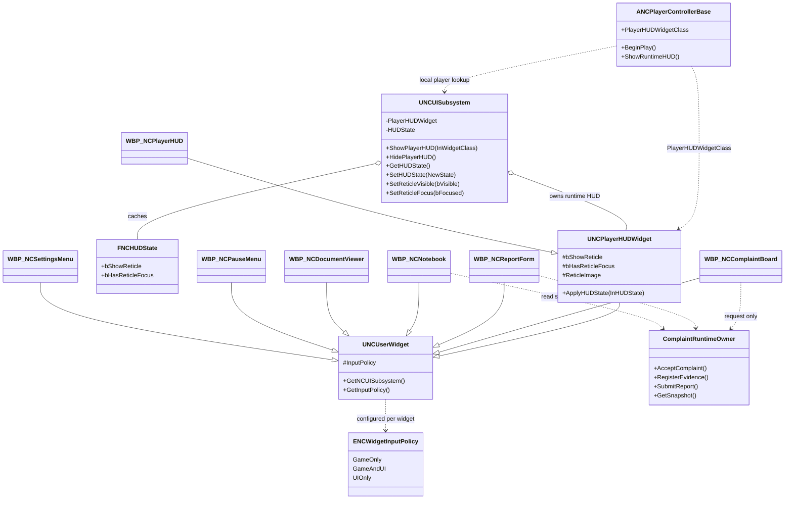
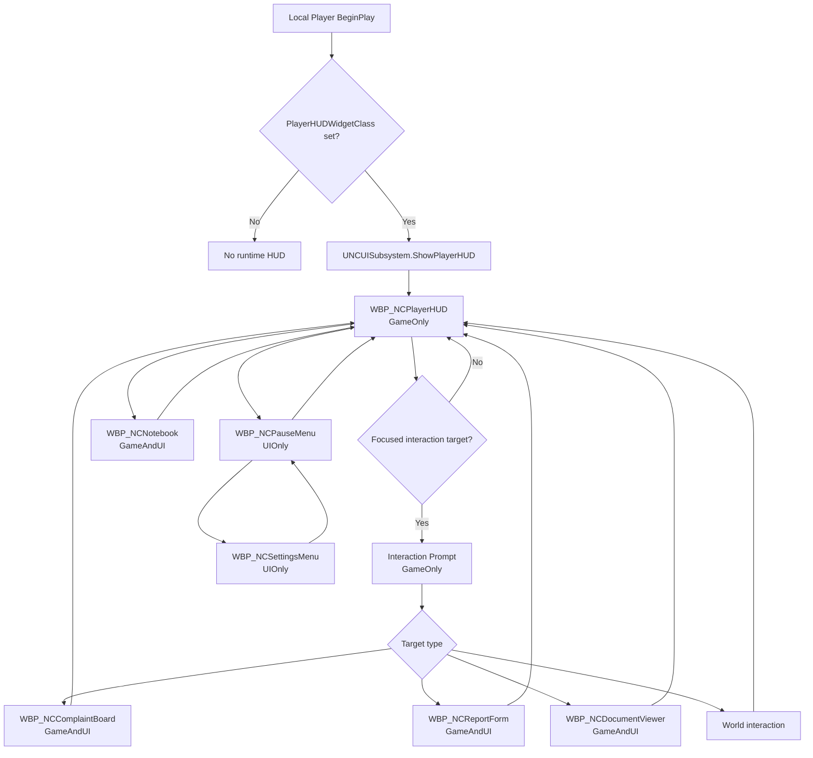
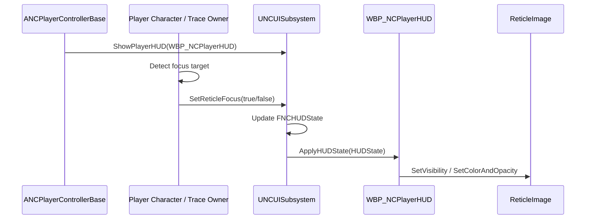
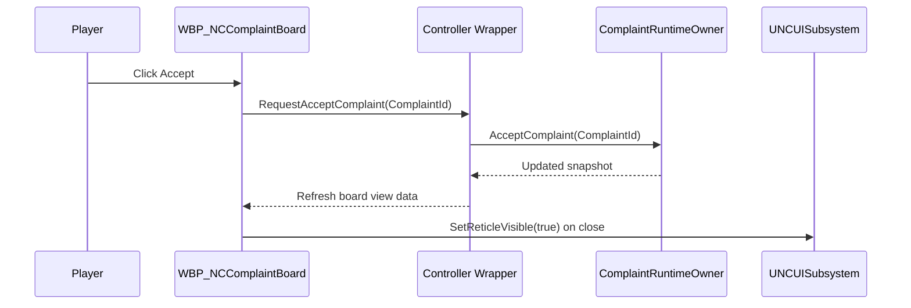
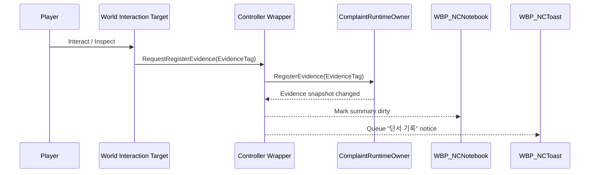
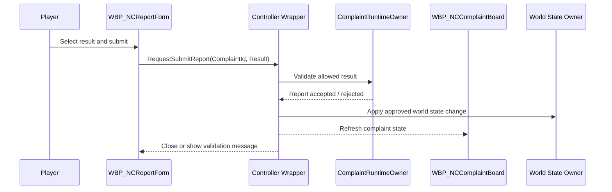
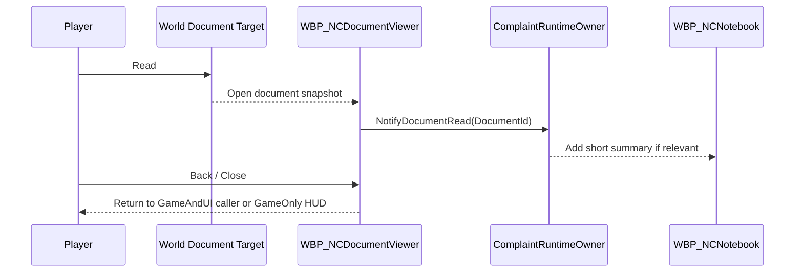
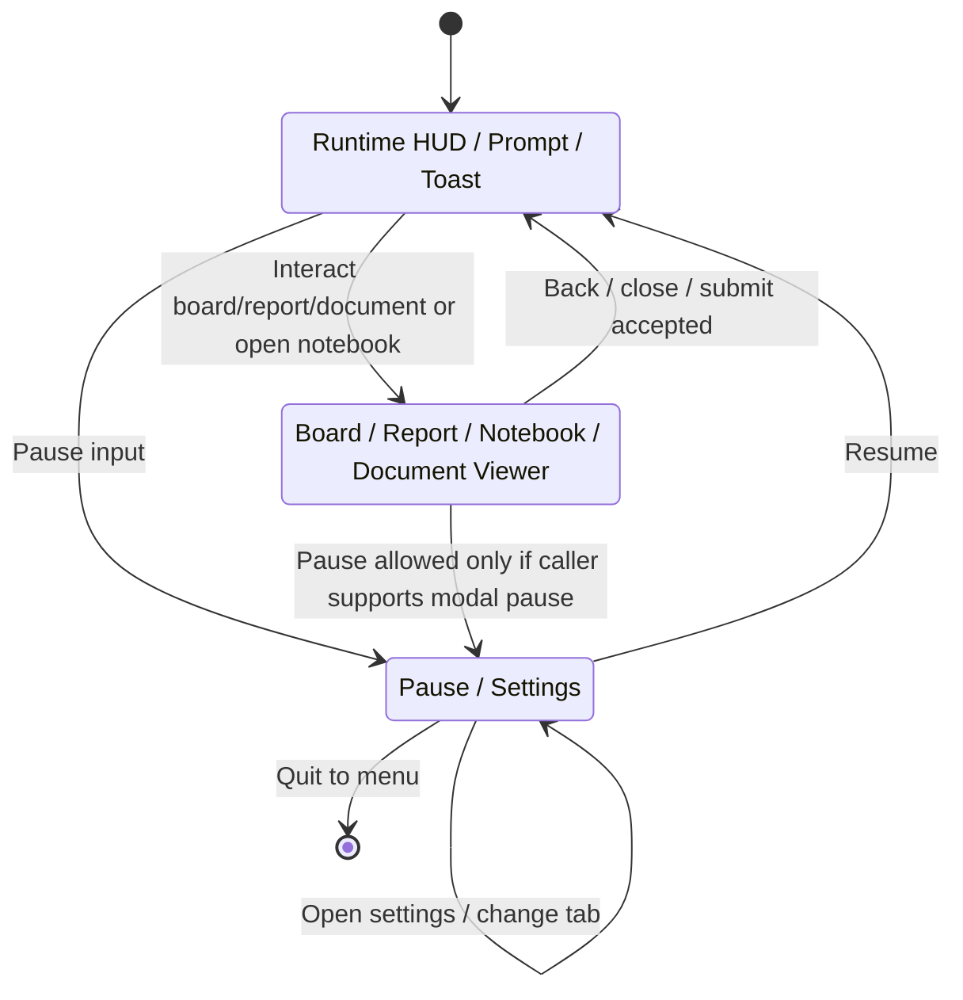
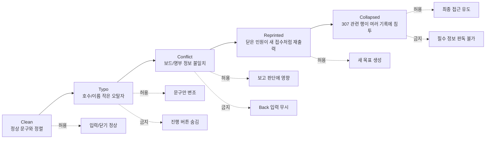

# NightCaretaker UI/UX Diagrams

## 목적

이 문서는 UI/UX 상세 문서를 구현자가 빠르게 검토할 수 있도록 만든 Mermaid companion 문서다. 런타임 기준은 현재 프로젝트의 UMG 구조이며, C++ 코드와 Blueprint asset은 이 문서 작업에서 변경하지 않는다.

## Widget / Runtime Class Boundary

## Widget Stack / Screen Transition

## HUD Focus Update Sequence

## Complaint Accept Sequence

## Evidence Registration Sequence

## Report Submit Sequence

## Document Read Sequence

## Input Policy State Machine

## RecordIntegrity UI Corruption Flow

## P0 / P1 Implementation Split

```mermaid
flowchart TD
    P0["P0 UI"] --> HUD["WBP_NCPlayerHUD<br/>ReticleImage binding"]
    P0 --> Prompt["Interaction Prompt"]
    P0 --> Board["WBP_NCComplaintBoard"]
    P0 --> Report["WBP_NCReportForm"]
    P0 --> Notebook["WBP_NCNotebook"]
    P0 --> Pause["WBP_NCPauseMenu"]
    P0 --> Settings["WBP_NCSettingsMenu"]

    P0Link["P0 connected, simple presentation"] --> Viewer["WBP_NCDocumentViewer"]
    P0Link --> Toast["WBP_NCToast"]

    P1["P1 polish"] --> Corruption["RecordIntegrity visual variants"]
    P1 --> Reopen["Document reread mutation"]
    P1 --> ToastQueue["Toast queue polish"]
    P1 --> CommonUICandidate["CommonUI review for menus only"]
```

