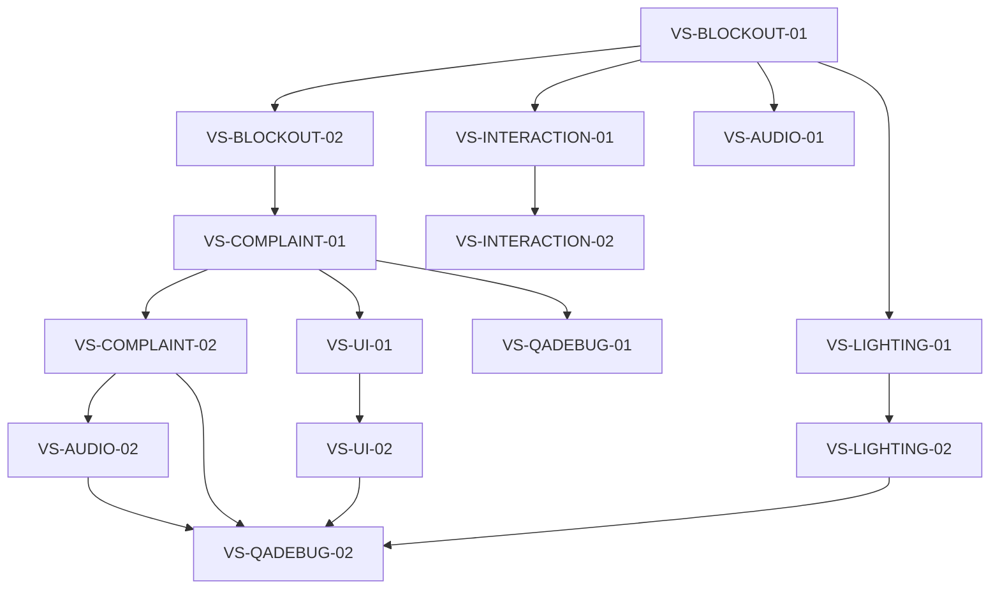
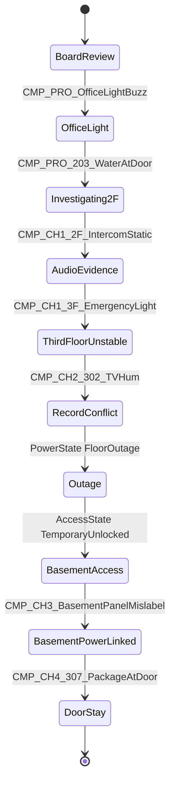
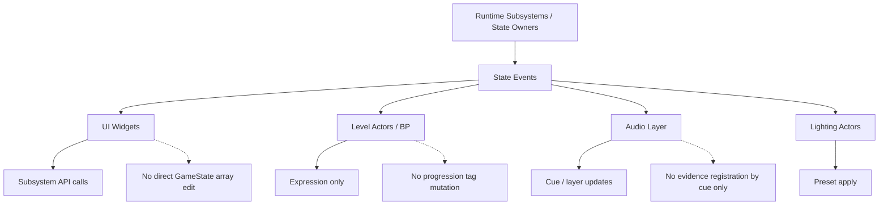
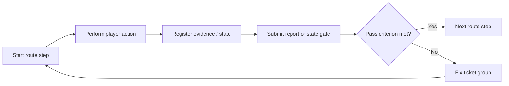
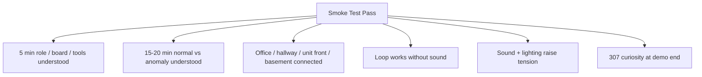
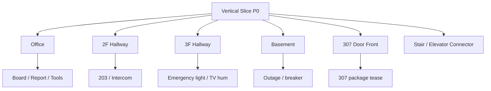

# NightCaretaker Vertical Slice Diagrams

## 목적

이 문서는 데모 수직 슬라이스 제작 체크리스트를 빠르게 검토하기 위한 Mermaid companion 문서다. 구현 기준은 Master 문서와 `NightCaretaker_VerticalSlice_Detail.md`를 우선한다.

## Vertical Slice Route

```mermaid
flowchart LR
    A["1 Office Handoff"] --> B["2 OfficeLightBuzz"]
    B --> C["3 203WaterAtDoor"]
    C --> D["4 IntercomStatic"]
    D --> E["5 3F EmergencyLight"]
    E --> F["6 302 TVHum"]
    F --> G["7 Power Outage"]
    G --> H["8 BasementPumpAlarm"]
    H --> I["9 BasementPanelMislabel"]
    I --> J["10 307PackageAtDoor"]

    J --> K["Demo End<br/>307 curiosity"]
```

## Ticket Dependency Flow

## State Gate Sequence

## Ownership Boundary

## Smoke-Test Loop

## Smoke-Test Criteria

## P0 Art / Implementation Split

