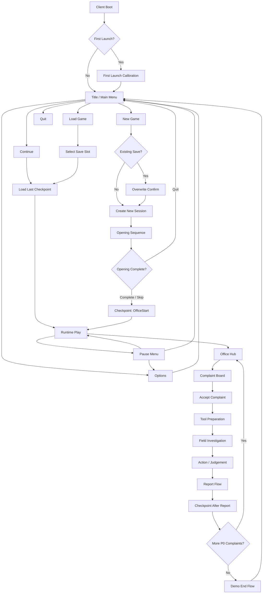
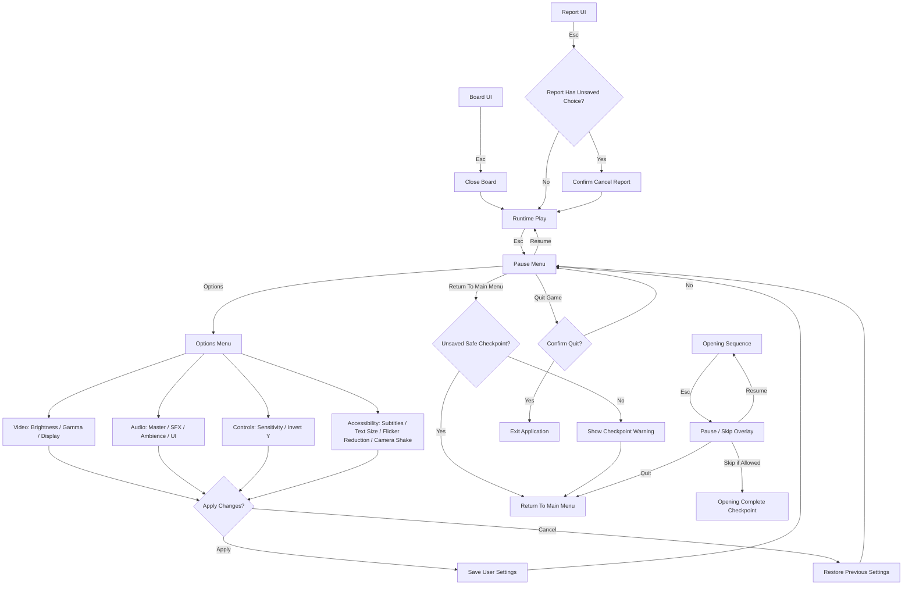
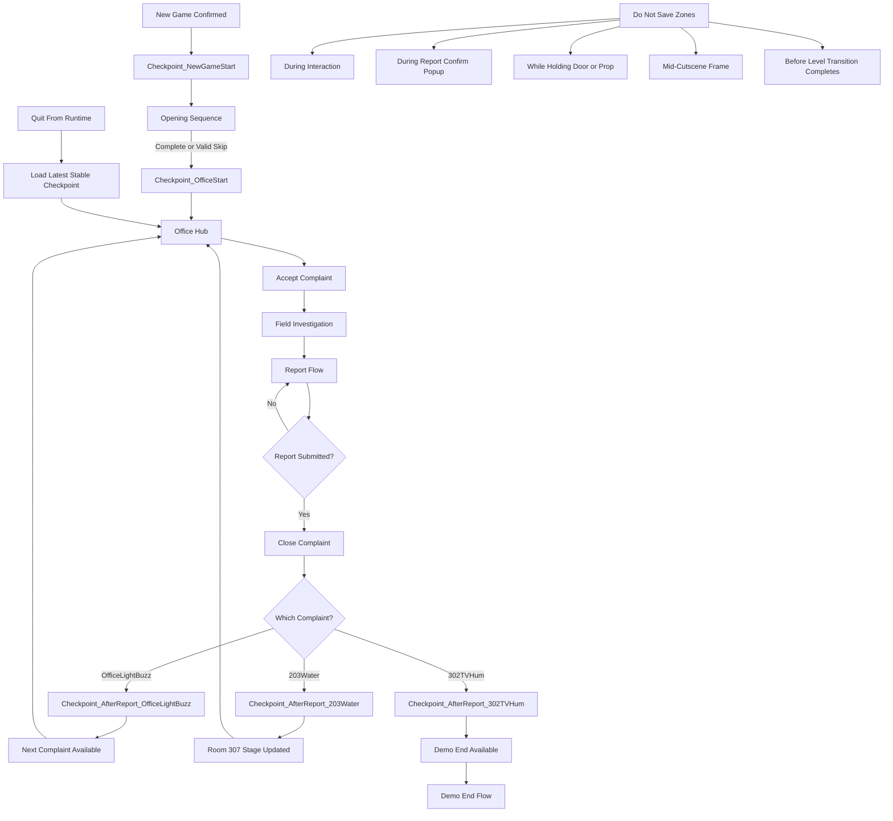

---
aliases:
  - "Player Flow Work Cards - Detail"
tags:
  - nightcaretaker
  - project/nightcaretaker
  - source
  - worklog
type: project-document
project: NightCaretaker
category: source-worklog
status: organized
updated: 2026-05-26
cssclasses:
  - readable-guide
---

# Player Flow Work Cards - Detail

> [!summary] 문서 목적
> 이 문서는 개발 프레임워크 관점이 아니라 실제 게임 클라이언트를 실행한 뒤의 흐름을 기준으로 작성한 작업카드다.

## 핵심 결론

- 이 문서는 작업 이력, 조사, 결정 과정, 구현 handoff를 추적하는 자료다.
- 활성 기준은 루트 Master 문서에 반영된 항목으로 판단한다.
- 후속 작업자는 입력 문서, 산출물, 완료 기준, 남은 리스크를 먼저 확인한다.

## 문서 정보

| 항목 | 내용 |
| --- | --- |
| 프로젝트 | NightCaretaker / 야간 관리인: 307호의 민원 |
| 문서 범주 | 작업 이력/조사 자료 |
| 파일 경로 | `Source/PlayerFlowWorkCards_Detail.md` |
| 프로젝트 경로 | `D:\UnrealProjects\NightCaretaker` |
| 정리 기준 | `Obsidian 문서 가독성 기준.md`, `HTML CSS 문서 제작 및 활용 기준.md` |

## 문서 지도

| 섹션 | 역할 |
| --- | --- |
| Intent | 주요 섹션 |
| P0 Assumptions | 주요 섹션 |
| Global Flow | 주요 섹션 |
| Global Flow Diagram | 세부 기준 |
| Screen State Model | 주요 섹션 |
| Control Baseline | 주요 섹션 |
| Work Cards | 주요 섹션 |
| FLOW-P0-00 Client Boot And First Launch | 세부 기준 |
| Required Settings | 보조 항목 |
| FLOW-P0-01 Title And Main Menu | 세부 기준 |
| Menu Behavior | 보조 항목 |
| FLOW-P0-02 Options And Accessibility | 세부 기준 |
| Option Set | 보조 항목 |
| FLOW-P0-03 New Game Start | 세부 기준 |
| 추가 섹션 31 개 | 원문 본문에서 이어서 확인한다. |

## 적용 기준

- 원문 의미와 프로젝트 용어를 보존한다.
- 긴 설명은 제목, 표, 목록, 체크리스트 중심으로 탐색 가능하게 유지한다.
- 활성 기준과 보관 자료를 구분한다.
- HTML companion 문서는 각 파일 내부에 CSS를 포함하는 self-contained 문서로 관리한다.

## 본문

## Intent

이 문서는 개발 프레임워크 관점이 아니라 실제 게임 클라이언트를 실행한 뒤의 흐름을 기준으로 작성한 작업카드다.
개발자는 이 문서를 보고 "플레이어가 어떤 화면을 보고, 어떤 버튼을 누르고, 그때 게임이 무엇을 해야 하는지"를 먼저 이해해야 한다.

## P0 Assumptions

| 항목        | 결정                                                                       |
| --------- | ------------------------------------------------------------------------ |
| P0 플레이 길이 | 15~20분                                                                   |
| P0 목표     | 메인 메뉴에서 새 게임을 시작해 관리실 근무, 민원 3개, 307 Stage 3까지 진행                        |
| 컷신 방식     | P0에서는 비싼 프리렌더 컷신보다 짧은 in-engine opening 또는 플레이어 통제 가능한 시작 연출을 우선         |
| 저장 방식     | 보고 완료 단위 자동 저장. P0에서는 수동 저장 슬롯보다 자동 체크포인트 우선                             |
| 옵션 범위     | 밝기/감마, 기본 오디오, 마우스 감도, 자막/텍스트 크기, 깜빡임 완화, 카메라 흔들림 완화                     |
| 일시정지      | 일반 플레이 중 가능. 보고/보드/옵션 UI 중에는 메뉴 stack 규칙 적용. opening sequence 중에는 제한적 허용 |

## Global Flow

```text
Client Boot
  -> First Launch Calibration or Title
  -> Main Menu
      -> New Game
      -> Continue
      -> Load Game
      -> Options
      -> Quit
  -> Opening Sequence
  -> Office Hub
  -> Complaint Board
  -> Tool Preparation
  -> Field Investigation
  -> Action / Judgement
  -> Report
  -> Checkpoint
  -> Next Complaint or Demo End
```

### Global Flow Diagram



## Screen State Model

| State | Player Sees | Input Mode | Pause | Save |
| --- | --- | --- | --- | --- |
| Boot | 로고/검은 화면/로딩 | None or Skip only | 불가 | 없음 |
| First Launch Calibration | 밝기/감마/자막 기본 설정 | UIOnly | 불가 | 옵션 저장 |
| Title | 타이틀 배경, 메뉴 | UIOnly | 해당 없음 | 없음 |
| Main Menu | 새 게임/이어하기/불러오기/옵션/종료 | UIOnly | 해당 없음 | 없음 |
| Options | 탭형 설정 화면 | UIOnly | 해당 없음 | 설정 저장 |
| Opening Sequence | 출근/근무 시작 연출 | GameOnly or Cinematic | 제한적 | 시작 체크포인트 후 |
| Runtime Play | HUD, reticle, 목표 | GameOnly | 가능 | 체크포인트 규칙 |
| Board UI | 민원 목록 | UIOnly or GameAndUI | 메뉴 stack 내 처리 | 없음 |
| Report UI | 보고 선택/증거 확인 | UIOnly or GameAndUI | 메뉴 stack 내 처리 | 보고 후 자동 저장 |
| Pause Menu | 이어하기/옵션/메인 메뉴로/종료 | UIOnly | 이미 Pause | 직접 저장 없음 |
| Demo End | 결과/다음 안내/메뉴 복귀 | UIOnly | 해당 없음 | 데모 종료 저장 선택 |

## Control Baseline

| Input | Runtime Function | UI Function | Notes |
| --- | --- | --- | --- |
| `WASD` | 이동 | 메뉴 focus 이동 optional | P0는 키보드/마우스 우선 |
| Mouse | 시야 회전 | 포인터/선택 | 옵션에서 감도 조절 |
| `E` or LMB | 상호작용 | 확인/선택 | 문, 보드, 단서, 도구함 |
| RMB or `Esc` | 취소/뒤로 | 뒤로가기 | Runtime에서는 Pause |
| `Shift` | 짧은 sprint 또는 빠른 걷기 | 없음 | 공포/조사 중 제한 가능 |
| `F` | 손전등 토글 | 없음 | P0 포함 여부는 도구 작업에서 결정 |
| `Tab` or `N` | 노트/현재 민원 보기 | 탭 전환 optional | P0에서는 최소 Current Complaint 패널 |
| `Esc` | Pause Menu | 뒤로가기/닫기 | UI stack 최상단부터 닫음 |
| Mouse Wheel | 도구/문서 스크롤 | 스크롤 | 인벤토리 wheel은 P0 제외 |

## Work Cards

### FLOW-P0-00 Client Boot And First Launch

| Field | Details |
| --- | --- |
| Player Sees | 로고, 짧은 로딩, 첫 실행 시 밝기/감마 설정 또는 바로 타이틀 |
| Player Can Do | 첫 실행 보정 화면에서는 밝기/감마 조절, 자막 기본값 선택, 적용 |
| Game Must Do | 설정 파일 생성, 기본 옵션 저장, 다음 실행부터 보정 화면 생략 |
| P0 Decision | 첫 실행 보정 화면은 있으면 좋다. 시간이 부족하면 Options 안에 밝기/감마를 먼저 넣고 보정 화면은 P1로 둔다. |
| Done | 첫 실행 여부에 따라 Calibration 또는 Main Menu로 안정적으로 이동한다. |

#### Required Settings

| Setting | P0 |
| --- | --- |
| Brightness | 포함 |
| Gamma | 포함 |
| Subtitle On/Off | 포함 권장 |
| Text Size | 포함 권장 |
| Safe Area | P1 |
| HDR Calibration | P1 |

### FLOW-P0-01 Title And Main Menu

| Field | Details |
| --- | --- |
| Player Sees | 게임 제목, 어두운 관리실/복도 배경, 메뉴 목록 |
| Menu Items | New Game, Continue, Load Game, Options, Credits optional, Quit |
| Player Can Do | 새 게임 시작, 마지막 저장 이어하기, 저장 슬롯 선택, 옵션 조절, 종료 |
| Game Must Do | save 존재 여부에 따라 Continue 활성/비활성, New Game 덮어쓰기 확인, Options 변경 저장 |
| Done | save가 없는 첫 실행에서도 New Game과 Options가 정상 동작한다. |

#### Menu Behavior

| Button | No Save | Existing Save |
| --- | --- | --- |
| New Game | 바로 시작 또는 슬롯 선택 | 덮어쓰기 확인 후 시작 |
| Continue | disabled | 가장 최근 autosave/checkpoint 로드 |
| Load Game | disabled 또는 빈 슬롯 표시 | 슬롯 목록 표시 |
| Options | enabled | enabled |
| Quit | enabled | enabled |

### FLOW-P0-02 Options And Accessibility

| Field | Details |
| --- | --- |
| Player Sees | Video, Audio, Controls, Accessibility 탭 |
| Player Can Do | 설정 변경, 적용, 기본값 복구, 뒤로가기 |
| Game Must Do | 변경값을 즉시 preview하거나 Apply 후 반영하고, 취소 시 이전 값 복구 |
| Done | 메인 메뉴와 Pause Menu 양쪽에서 같은 Options 화면을 열 수 있다. |

#### Option Set

| Tab | P0 Options | Notes |
| --- | --- | --- |
| Video | Brightness, Gamma, Fullscreen/Windowed, Resolution, VSync | 공포 의도를 해치지 않는 범위에서 밝기/감마 제공 |
| Audio | Master, SFX, Ambience, UI Volume, Dynamic Range basic | 단서성 소리가 묻히지 않게 조절 |
| Controls | Mouse Sensitivity, Invert Y, Key Bindings P1 | P0는 감도와 invert 우선 |
| Accessibility | Subtitles, Text Size, Flicker Reduction, Camera Shake Reduction | 공포 연출보다 플레이 가능성 우선 |
| Gameplay | Interaction Prompt On/Off, Objective Hint Level P1 | P0는 On 고정 가능 |

### FLOW-P0-03 New Game Start

| Field | Details |
| --- | --- |
| Player Sees | 새 게임 확인, 기존 저장이 있으면 덮어쓰기 경고 |
| Player Can Do | 새 게임 시작, 취소, 슬롯 선택 optional |
| Game Must Do | 새 session id 생성, 기존 autosave 처리, 초기 설정 로드, opening sequence 진입 |
| P0 Decision | P0에서는 단일 autosave 슬롯 우선. 수동 슬롯 UI는 P1로 둔다. |
| Done | New Game을 누르면 항상 같은 초기 상태에서 시작한다. |

#### Overwrite Rule

- save가 없으면 확인 없이 시작 가능.
- save가 있으면 "기존 진행 상황을 덮어씁니다" 확인 필요.
- 덮어쓰기 확정 시 새 게임 시작 전 기존 runtime state를 초기화한다.

### FLOW-P0-04 Load And Continue

| Field | Details |
| --- | --- |
| Player Sees | Continue 또는 Load Game 목록 |
| Player Can Do | 최근 저장 이어하기, 저장 슬롯 선택, 뒤로가기 |
| Game Must Do | 저장 메타데이터 표시, 손상/버전 불일치 처리, 로딩 실패 시 메인 메뉴 복귀 |
| P0 Decision | Continue는 가장 최근 autosave만 지원해도 된다. Load Game 슬롯 UI는 P1 가능. |
| Done | 보고 후 저장된 체크포인트에서 재시작할 수 있다. |

#### Save Metadata

| Field | Example |
| --- | --- |
| Chapter | Prologue / CH_01 |
| Location | 관리실 |
| Last Complaint | `CMP_CH1_203_WaterAtDoor` |
| Last Saved Time | 실제 저장 시각 |
| Play Time | optional |

### FLOW-P0-05 Opening Sequence

| Field | Details |
| --- | --- |
| Player Sees | 출근, 관리실 도착, 야간 근무 시작 연출 |
| Player Can Do | P0에서는 가능한 한 짧게 걷기/보기 정도를 허용한다. 완전 컷신은 최소화 |
| Game Must Do | 플레이어 역할, 관리실 위치, 첫 업무 목적을 전달하고 첫 체크포인트를 만든다. |
| Pause Rule | 완전 비상호작용 컷신 중에는 Pause/Skip overlay만 허용. 조작 가능 구간부터 일반 Pause 허용 |
| Skip Rule | 첫 플레이에서는 skip disabled 또는 길게 누르기. 재시청/재시작에서는 skip 가능 |
| Done | 플레이어가 5분 안에 "나는 야간 관리인이고 민원을 확인해야 한다"를 이해한다. |

#### Cutscene Save Rule

| Situation | Save Behavior |
| --- | --- |
| 컷신 시작 전 quit | Main Menu로 복귀, 새 게임 시작 전 상태 |
| 컷신 중 quit | 마지막 안정 체크포인트로 복귀. P0는 opening 시작점 |
| 컷신 완료 | `Checkpoint_OfficeStart` 저장 |
| 컷신 skip | skip 대상 checkpoint가 있어야만 허용 |

### FLOW-P0-06 Runtime Controls

| Field | Details |
| --- | --- |
| Player Sees | 1인칭 화면, reticle, 최소 목표 텍스트, 상호작용 prompt |
| Player Can Do | 이동, 보기, 상호작용, 문/프랍 조작, 손전등, 현재 민원 확인, Pause |
| Game Must Do | 입력 mode를 안정적으로 관리하고 UI가 열린 동안 gameplay input 충돌을 막는다. |
| Done | 플레이어가 조작 설명 없이 기본 이동/상호작용을 수행한다. |

#### Runtime Input Conditions

| Condition | Input Rule |
| --- | --- |
| 기본 플레이 | `GameOnly`, 이동/보기/상호작용 가능 |
| 문/프랍 precision interaction | RealityCam 흔들림 완화, 취소/놓기 가능 |
| 보드/보고 UI | `UIOnly` 또는 `GameAndUI`, 이동 잠금 |
| Pause | `UIOnly`, 시간 정지 |
| Opening cinematic | cinematic policy에 따름 |

### FLOW-P0-07 Office Hub Flow

| Field | Details |
| --- | --- |
| Player Sees | 관리실 책상, 민원 보드/단말, 도구함, 보고 위치 |
| Player Can Do | 보드 확인, 도구 선택, 보고 UI 열기, Pause |
| Game Must Do | 상호작용 가능한 대상에 prompt 표시, 현재 단계와 맞지 않는 대상은 설명만 제공 |
| Done | 플레이어가 관리실에서 다음 행동을 잃지 않는다. |

#### Office Object Behavior

| Object | Before Complaint | During Complaint | After Field Investigation |
| --- | --- | --- | --- |
| Complaint Board | 민원 선택 가능 | 현재 민원 확인만 가능 | 다음 민원 또는 report 안내 |
| Tool Box | 기본 도구 선택 가능 | 필요한 도구 재선택 가능 | 선택 가능 |
| Report Desk/Terminal | "보고할 민원 없음" | "현장 확인 필요" | 보고 UI 열림 |
| Door/Exit | 현장 이동 가능 여부 표시 | 이동 가능 | 이동 가능 |

### FLOW-P0-08 Complaint Board Flow

| Field | Details |
| --- | --- |
| Player Sees | 접수된 민원 목록, 위치, 증상, 필요 도구 힌트 |
| Player Can Do | 민원 선택, 상세 확인, 뒤로가기 |
| Game Must Do | Available 민원만 선택 가능하게 하고, 선택 시 FocusedComplaint를 설정한다. |
| Done | 민원을 선택하면 목표가 현장 이동으로 바뀐다. |

#### Board Display Fields

| Field | P0 Display |
| --- | --- |
| Title | 표시 |
| Location | 표시 |
| Symptom | 짧게 표시 |
| Required Tool Hint | 표시 |
| Priority | P1 |
| Resident Name | 기록 공포가 필요할 때만 제한 표시 |

### FLOW-P0-09 Tool Preparation Flow

| Field | Details |
| --- | --- |
| Player Sees | 도구함, 선택 가능한 도구, 현재 보유 도구 |
| Player Can Do | 도구 선택/교체, 취소 |
| Game Must Do | HeldToolTags를 갱신하고 민원 RequiredToolTags와 비교한다. |
| Done | 잘못된 도구를 들고 현장에 가면 조치가 막히지만, 관리실로 돌아와 수정할 수 있다. |

#### P0 Tool List

| Tool | Use |
| --- | --- |
| Flashlight | 어두운 복도/문틈 확인 |
| Screwdriver or Panel Tool | 형광등/패널/간단 설비 |
| Notebook | 기록/표기 불일치 확인 |
| Wrench | 누수/밸브 조치 |

P0에서는 도구 무게, 슬롯, 조합, 소모품은 구현하지 않는다.

### FLOW-P0-10 Field Investigation Flow

| Field | Details |
| --- | --- |
| Player Sees | 현장 위치, 단서, 상호작용 prompt, 미세한 이상 징후 |
| Player Can Do | 단서 확인, 문/스위치/프랍 조작, 현장 조치, 관리실 복귀 |
| Game Must Do | 증거 태그를 누적하고 보고 가능 여부를 갱신한다. |
| Done | 플레이어가 정상 원인과 이상 징후를 구분하려고 멈춘다. |

#### Investigation Rule

| Type | Behavior |
| --- | --- |
| Required Evidence | 보고 가능 조건에 영향을 준다. |
| Optional Evidence | 307 progression, achievement, 추가 텍스트에만 영향 가능 |
| Wrong Location | 현재 민원과 무관하다는 prompt 또는 silence |
| Repeated Evidence | 중복 추가 없이 이미 확인한 상태로 표시 |

### FLOW-P0-11 Report Flow

| Field | Details |
| --- | --- |
| Player Sees | 민원 제목, 확인한 단서, 가능한 보고 결과 |
| Player Can Do | Resolved, No Anomaly, Needs Follow Up 중 선택 |
| Game Must Do | 선택 결과를 runtime state에 저장하고 progression tag, 다음 민원, 307 stage를 갱신한다. |
| Done | 보고 후 단순 종료가 아니라 다음 민원 또는 307 변화가 열린다. |

#### Report Result Meaning

| Result | Meaning |
| --- | --- |
| Resolved | 정상 조치 완료 |
| No Anomaly | 이상 없음으로 판단 |
| Needs Follow Up | 정상 해결로 설명되지 않음 |

P0에서는 정답/오답으로 즉시 실패시키지 않는다.
보고 결과는 다음 정보와 불안의 형태를 바꾸는 데 사용한다.

### FLOW-P0-12 Pause During Play

| Field | Details |
| --- | --- |
| Player Sees | 이어하기, 옵션, 메인 메뉴로, 종료 |
| Player Can Do | 게임 재개, 옵션 변경, 메인 메뉴 복귀, 게임 종료 |
| Game Must Do | 게임 시간을 정지하고 UI input으로 전환한다. 메뉴 stack 최상단부터 닫는다. |
| Done | Runtime, Board UI, Report UI, Opening 각 상태에서 Pause 동작 규칙이 명확하다. |

#### Pause Matrix

| Current State | Pause Allowed | Options Allowed | Quit Behavior |
| --- | --- | --- | --- |
| Runtime Play | Yes | Full P0 Options | 마지막 checkpoint에서 재개 |
| Board UI | Esc는 Board 닫기 우선 | Board 닫은 뒤 Pause | 저장 없음 |
| Report UI | Esc는 confirm/cancel 정책 필요 | 가능하나 입력 충돌 금지 | 보고 전이면 이전 checkpoint |
| Opening Noninteractive | Pause/Skip overlay only | Brightness/Audio/Subtitles 정도만 | opening start checkpoint |
| Demo End | Pause 불필요 | Options optional | Main Menu |

### FLOW-P0-13 Save And Checkpoint Rules

| Field | Details |
| --- | --- |
| Player Sees | 저장 아이콘 optional, 메뉴의 Continue 활성화 |
| Player Can Do | P0에서는 수동 저장 없음. Continue로 최근 체크포인트 복귀 |
| Game Must Do | 안전한 시점에 자동 저장하고, quit/load 시 재개 위치를 예측 가능하게 한다. |
| Done | 보고 후 게임을 종료해도 해당 보고 완료 상태에서 재개된다. |

#### Checkpoint List

| Checkpoint | Trigger | Load Position |
| --- | --- | --- |
| `Checkpoint_NewGameStart` | New Game 확정 | Opening 시작 |
| `Checkpoint_OfficeStart` | Opening 완료 | 관리실 시작 위치 |
| `Checkpoint_AfterReport_OfficeLightBuzz` | 첫 보고 완료 | 관리실, 다음 민원 available |
| `Checkpoint_AfterReport_203Water` | 203 보고 완료 | 관리실, 307 Stage 갱신 |
| `Checkpoint_AfterReport_302TVHum` | 302 보고 완료 | 관리실 또는 demo end |

#### Do Not Save

- 상호작용 중.
- 보고 선택 확인 팝업 중.
- 문/프랍을 잡고 있는 중.
- 컷신 중간 프레임.
- 레벨 전환이 끝나기 전.

### FLOW-P0-14 Demo End Flow

| Field | Details |
| --- | --- |
| Player Sees | 짧은 종료 메시지, 현재 데모 종료, 메인 메뉴로 돌아가기 |
| Player Can Do | 메인 메뉴 복귀, 옵션, 종료 |
| Game Must Do | 마지막 체크포인트 또는 demo complete flag를 저장한다. |
| Done | 데모 종료 후 Continue를 누르면 의도한 위치 또는 데모 종료 상태로 이동한다. |

P0 데모 종료는 307호 내부를 열지 않는다.
목표는 "307호를 확인하고 싶다"는 감정에서 끊는 것이다.

## Pause / Options Flow Diagram



## Save / Checkpoint Flow Diagram



## Cross-State Rules

### UI Stack Rule

```text
Runtime HUD
  -> Board UI
  -> Report UI
  -> Pause Menu
  -> Options
```

- 같은 계층 UI를 동시에 두 개 열지 않는다.
- `Esc`는 가장 위 UI를 닫는다.
- Runtime에서 `Esc`는 Pause를 연다.
- Options에서 변경 후 뒤로가기는 적용/취소 정책을 명확히 묻는다.

### Cutscene Rule

- P0에서는 긴 컷신을 만들지 않는다.
- 컷신이 필요하면 in-engine sequence로 만들고, camera skip/pause 정책을 먼저 정한다.
- 컷신 중 저장은 시작점 또는 완료점만 허용한다.
- 컷신 중 Options는 Brightness, Audio, Subtitle 정도로 제한한다.

### Settings Persistence Rule

- 옵션은 save game과 분리해 user settings로 저장한다.
- New Game을 눌러도 밝기/감마/오디오/입력 설정은 유지한다.
- Reset Defaults는 현재 탭 또는 전체 옵션 중 어느 범위인지 명확히 표시한다.

## Player-Flow Acceptance Criteria

| 기준 | 통과 신호 |
| --- | --- |
| Menu clarity | 첫 실행 유저가 New Game과 Options를 바로 찾는다. |
| Settings confidence | 밝기/감마, 오디오, 감도 변경 후 차이를 확인할 수 있다. |
| Start clarity | New Game 후 플레이어가 5분 안에 관리인 역할과 첫 민원 목표를 이해한다. |
| Pause consistency | 어떤 화면에서 `Esc`를 눌러도 예상 가능한 결과가 나온다. |
| Save confidence | 보고 후 종료하고 Continue를 눌렀을 때 납득 가능한 위치에서 재개된다. |
| Flow continuity | 민원 접수, 도구, 현장, 보고, 다음 민원이 끊기지 않는다. |
| 307 hook | 데모 종료 전 307호를 확인하고 싶다는 반응이 나온다. |

## Recommended Next Step

이 Markdown 기준이 맞으면 다음 작업은 두 갈래다.

1. 이 문서를 HTML/CSS 작업카드 보드로 변환한다.
2. `NightCaretaker_Development_Master.md`에 `Player Flow Layer` 섹션을 추가해 프레임워크 작업카드보다 앞에 배치한다.

## 검토 체크리스트

- [ ] 현재 판단 기준과 보관/조사 자료가 구분되어 있다.
- [ ] 다음 작업자가 먼저 볼 섹션을 문서 지도에서 찾을 수 있다.
- [ ] 표, 목록, 체크리스트가 긴 문단을 보완한다.
- [ ] Planning/Development/Art Master와 충돌하는 항목은 별도로 승격 또는 폐기 판단한다.
- [ ] HTML companion이 필요한 경우 외부 CSS 의존 없이 내장 CSS로 작성한다.
